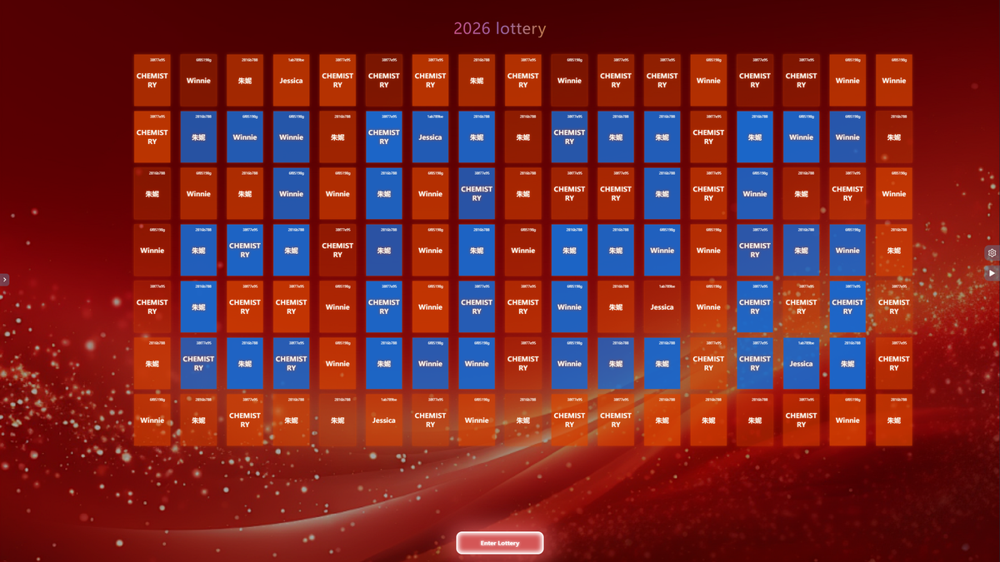
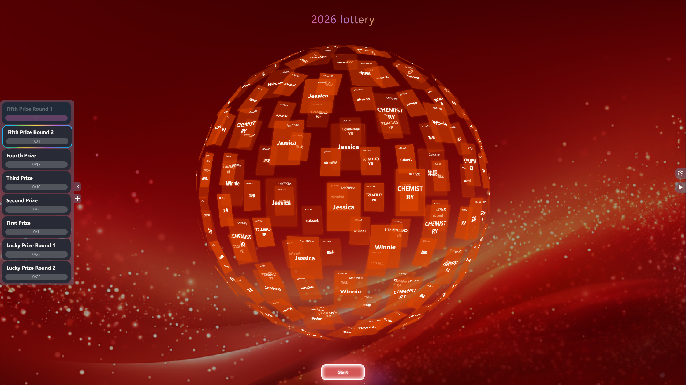
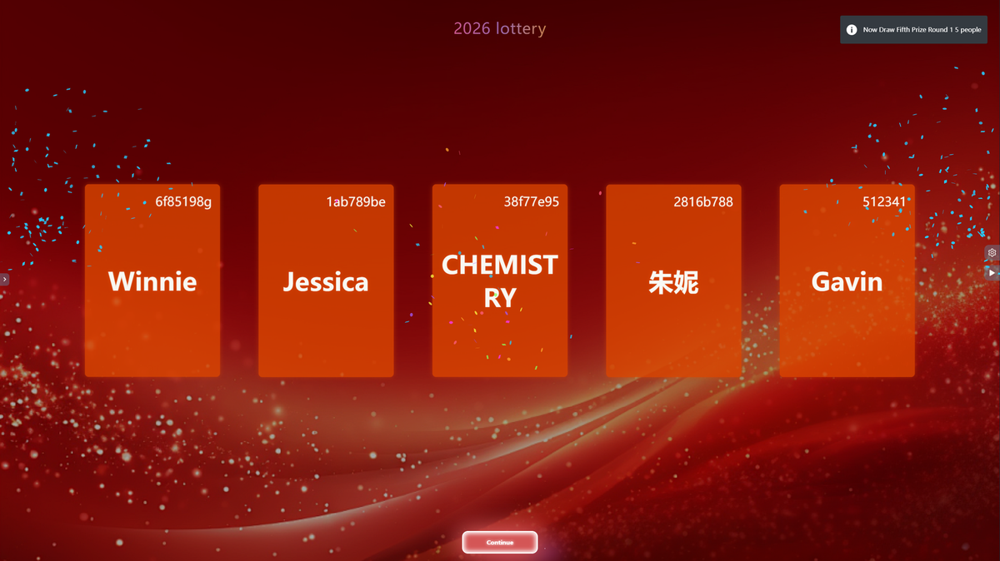

## 📖 项目简介

lottery-draw 是一个可配置、可定制化的抽奖应用，采用炫酷的 3D 球体展示效果，适用于年会抽奖等活动场景。支持奖品配置、人员管理、界面自定义、图片音乐配置、语音控制等功能。

> 💡 **浏览器要求**：请使用 PC 端最新版 Chrome 或 Edge 浏览器访问。

## ✨ 功能特性

- [x] 🕍 炫酷 3D 球体，年会抽奖必备，开箱即用
- [x] 💾 本地持久化存储（IndexedDB）
- [x] 🎁 奖品奖项配置管理
- [x] 👱 抽奖名单设置与管理
- [x] 🎼 背景音乐播放
- [x] 🖼️ Excel 表格导入人员名单、抽奖结果 Excel 导出
- [x] 🎈 可增加临时抽奖
- [x] 🧨 国际化多语言支持
- [x] 🍃 更换背景图片
- [x] 🎤 语音控制抽奖（支持语音命令开始、停止、继续抽奖）
- [x] 📸 照片缓存优化（提升加载性能）
- [x] 🎨 中英文名布局优化（更好的显示效果）
- [x] 📏 中奖卡片缩放优化（自适应不同屏幕）
- [x] 🛡️ 删除按钮防误触优化

## 📸 功能预览

### 首页展示

<div align="center">
    
    
</div>

### 抽奖界面

<div align="center">
    
    
</div>

## 🔄 最近更新

### 性能优化
- ✅ **照片缓存优化**：优化了照片加载机制，采用智能缓存策略，大幅提升照片加载速度和用户体验
- ✅ **中奖卡片缩放优化**：优化了中奖卡片的缩放逻辑，支持自适应不同屏幕尺寸，确保在各种设备上都能完美显示

### 界面优化
- ✅ **中英文名布局优化**：优化了中英文姓名的显示布局，解决了长文本换行和显示不完整的问题，提升了可读性

### 交互优化
- ✅ **删除按钮防误触**：修复了删除按钮误触的问题，增加了确认机制，避免误操作导致数据丢失

## 📚 使用指南

### 配置参与人员

1. 进入【人员配置管理】界面
2. 下载 Excel 模板
3. 按要求填写人员数据
4. 导入 Excel 文件
5. 支持导出已中奖人员结果

### 配置奖项

1. 进入【奖项配置管理】界面
2. 添加奖项
3. 自定义修改：
   - 奖项名称
   - 抽取人数
   - 是否全员参加
   - 图片显示

### 界面配置

可自定义配置：
- 标题
- 列数
- 卡片颜色
- 首页图案

### 图片和音乐管理

上传图片或音乐文件，数据使用 IndexedDB 在浏览器本地进行存储。系统已优化照片缓存机制，支持智能缓存策略，提升加载性能。

### 语音控制抽奖

支持使用语音命令控制抽奖流程，解放双手，提升互动体验：

- **开始抽奖**：说出"开始抽奖"、"进入抽奖"、"开始"、"抽奖"、"进入"等命令
- **停止抽奖**：说出"喊停"、"停止"、"停"、"好运连连"等命令
- **继续抽奖**：说出"继续"、"继续抽奖"、"再来一次"等命令

> 💡 **提示**：语音控制功能需要浏览器支持 Web Speech API（Chrome、Edge 等现代浏览器），首次使用需要授权麦克风权限。

## 🛠️ 技术栈

- **Vue 3** - 渐进式 JavaScript 框架
- **Three.js** - 3D 图形库
- **IndexedDB** - 浏览器本地数据库
- **Pinia** - Vue 状态管理
- **DaisyUI** - Tailwind CSS 组件库

## 🚀 快速开始

### 环境要求

- Node.js >= 16.x
- pnpm 或 npm

### 安装依赖

```bash
pnpm install
# 或
npm install
```

### 开发运行

```bash
pnpm dev
# 或
npm run dev
```

### 构建打包

```bash
pnpm build
# 或
npm run build:pre
```

> 💡 **项目来源**：<https://github.com/guojipeng5034/lottery>